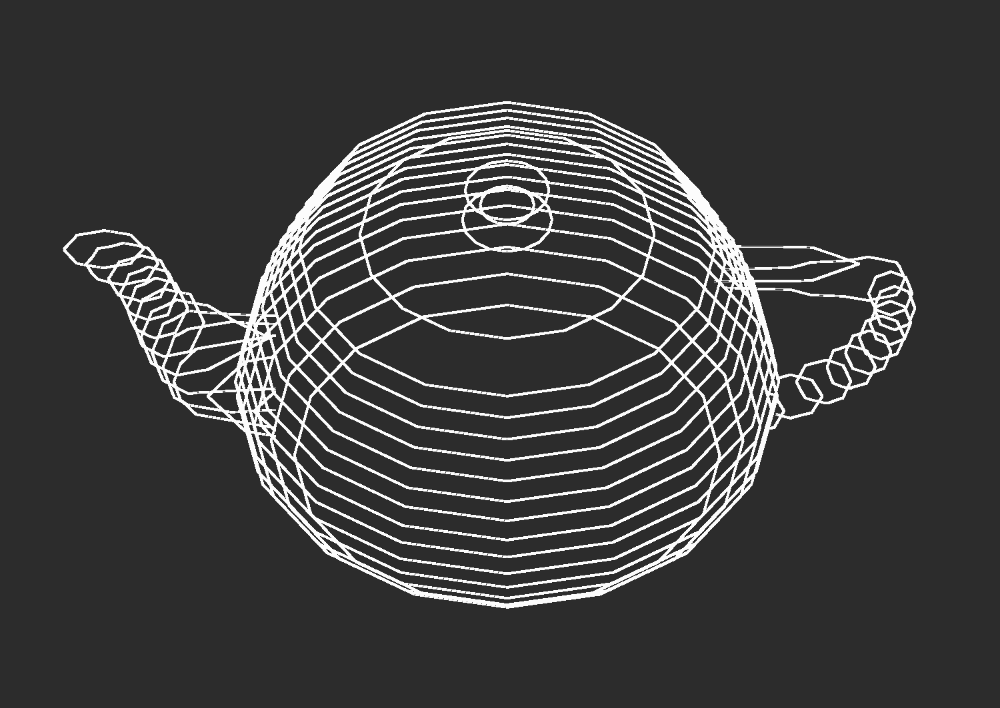
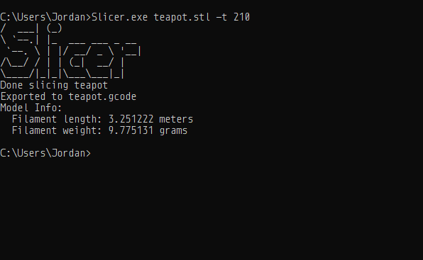
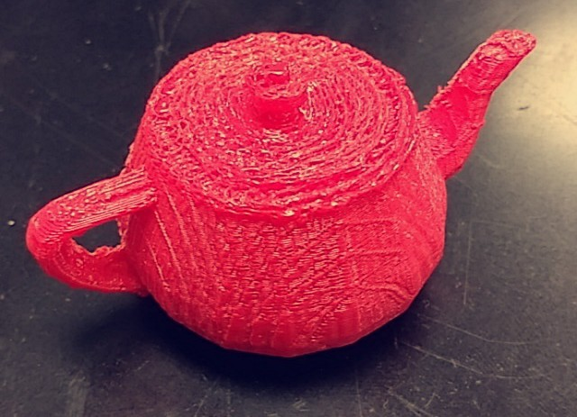

The Slicer Project
==================

Introduction
===============

### What is a Slicer?

A slicer is a piece of software that takes a 3D model and turns it into machine code that can be read and executed by an additive manufacturing machine such as a 3D printer. Examples of modern slicing programs include Cura, Simplify3D, and Slic3r, among others. The goal of a slicer is to create specific G-Code that can be read by a numerically controlled machine such as a FDM (Fused Deposition Modeling) printer, the generic plastic extrusion type of 3D printer this project is designed around. The standard input format for slicers in general is .stl files, which stands for stereo-lithography, one of the earliest forms of 3D printing. These files are a collection of triangles defined by their vertices in 3D space.

### Features

The Slicer Project can slice any .stl file that follows the correct STL format, this includes both ASCII and binary .stl files. The slicer currently has two output options, G-Code for FDM printers, and a series of vectors for each layer that can be stacked topographically (ex. laser cutting height maps). The slicer includes a set of pre-processing features that are applied before it slices the model. These include:

*   Rotation about X, Y, and Z axes
*   Translation over X, Y, and Z axes

The slicer also has many options for slicing settings. These include the following:

*   Height of each layer
*   Temperature of the printer’s hot-end
*   Temperature of the printer’s print bed (if applicable)
*   Percent of the inside of the model to fill with material
*   Length of the print bed in X and Y directions

With the exception of the layer height, the above settings are not necessary if slicing with vector files as the selected output.

Usage
========

The Slicer Project currently has no graphical interface, and can only be run from the command line. The format when running from the command line is as follows:

&nbsp;&nbsp;&nbsp;&nbsp; **slicer.exe** \[filename\] \[`option1` argument1\] … \[`optionN` argumentN\]

The command line arguments for this program are the option followed by the value being set. For instance, if a user wanted to move the model along the x-axis, they would append `-tX` to the command, followed by the number of millimeters they wanted to move the model, like so:

&nbsp;&nbsp;&nbsp;&nbsp; **slicer.exe** examplefile.stl `-tX` 20

Or alternatively:

&nbsp;&nbsp;&nbsp;&nbsp; **slicer.exe** examplefile.stl `--translateX` 20

Any options that are not explicitly specified will use whatever default option is listed.

####   
Examples:

&nbsp;&nbsp;&nbsp;&nbsp; **slicer.exe** cube.stl `-rX` 90 `-l` 0.175 `-t` 210  

Rotates “cube.stl” by 90, then slices at 0.175mm layer height for a 210°C hot-end.

&nbsp;&nbsp;&nbsp;&nbsp; **slicer.exe** dinosaur.stl `-tZ` 10 `-f` SVG  

Moves “dinosaur.stl” up 10mm on the Z axis, then slices to a series of vectorized layers.

&nbsp;&nbsp;&nbsp;&nbsp; **slicer.exe** penguin.stl `-i` 50 `-t` 205 `-b` 55  

Slices “penguin.stl” with 50% infill for a 205°C hot-end and a 55°C heated print bed.

The full list of command-line options for the slicer are the following:

| Default     | Long Option           | Description                                    | Default |
|-------------|-----------------------|------------------------------------------------|---------|
| `-tX` \[n\] | `--translateX` \[n\]  | Move model along x axis n millimeters          | 0.0     |
| `-tY` \[n\] | `--translateY` \[n\]  | Move model along Y axis n millimeters          | 0.0     |
| `-tZ` \[n\] | `--translateZ` \[n\]  | Move model along Z axis n millimeters          | 0.0     |
| `-rX` \[n\] | `--rotateX` \[n\]     | Rotate model around x axis by n radians        | 0.0     |
| `-rY` \[n\] | `--rotateY` \[n\]     | Rotate model around Y axis by n radians        | 0.0     |
| `-rZ` \[n\] | `--rotateZ` \[n\]     | Rotate model around Z axis by n radians        | 0.0     |
| `-s`        | `--swap`              | Swap rotation and translation order            |         |
| `-l` \[n\]  | `--layerheight` \[n\] | Set layer height to n                          | 0.2     |
| `-t` \[n\]  | `--temp` \[n\]        | Set hot-end temperature to n degrees (Celsius) | 200     |
| `-b` \[n\]  | `--bed` \[n\]         | Set bed temperature to n degrees (Celsius)     | 60      |
| `-i` \[n\]  | `--infill` \[n\]      | Set infill percentage to n%                    | 15      |
| `-x` \[n\]  | `--xLength` \[n\]     | Define bed X length as n millimeters           | 120     |
| `-y` \[n\]  | `--yLength` \[n\]     | Define bed Y length as n millimeters           | 120     |
| `-f` \[f\]  | `--format` \[f\]      | Change export format type (GCode, SVG)         | GCode   |
| `-h`        | `--help`              | Display help dialogue                          |         |

  

#### Special thanks to:  

Alexander Ov, for help with additive manufacturing  
Michael Martin, for documentation review  
Samuel Green, for helping to print test models  
Timothy Crowder, for testing print settings and software  
Trevor Stavropoulos, for his assistance with vector maths